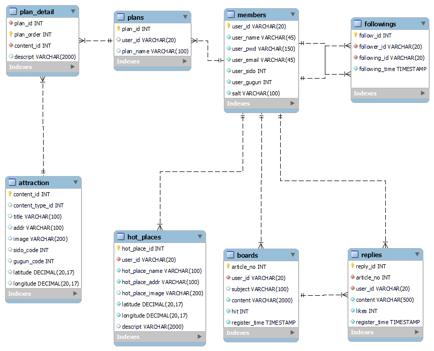
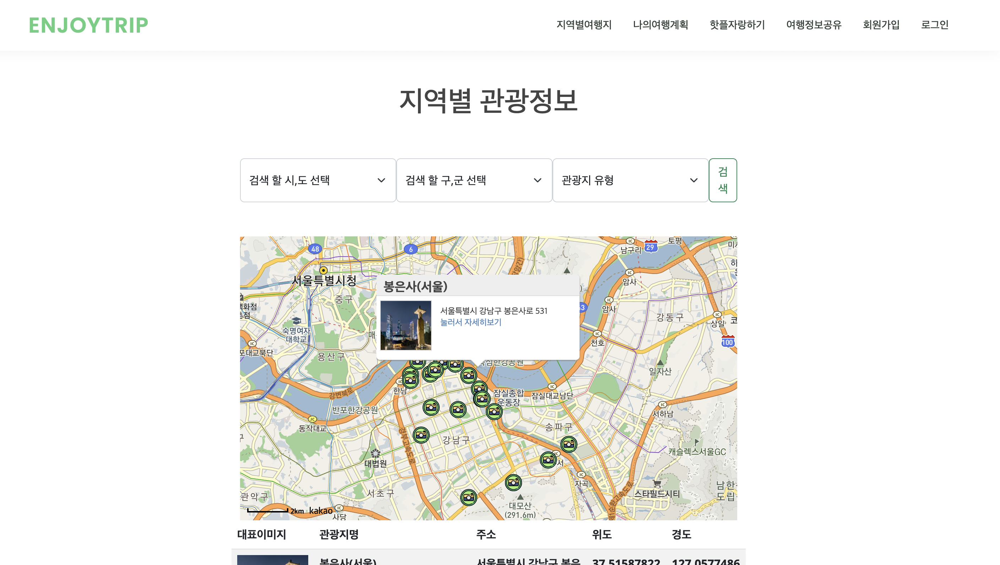
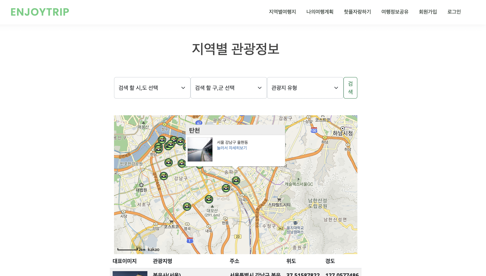
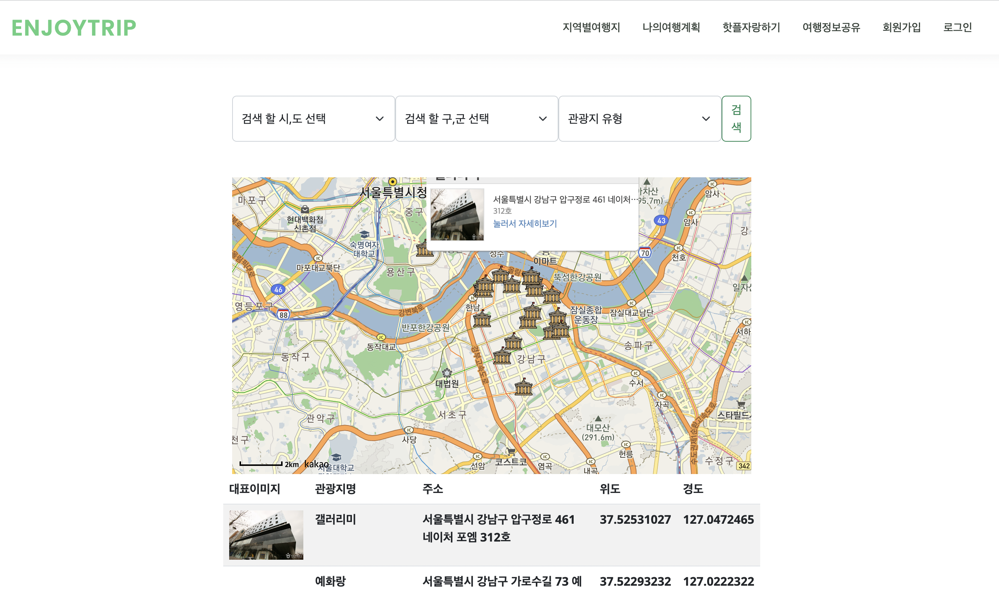
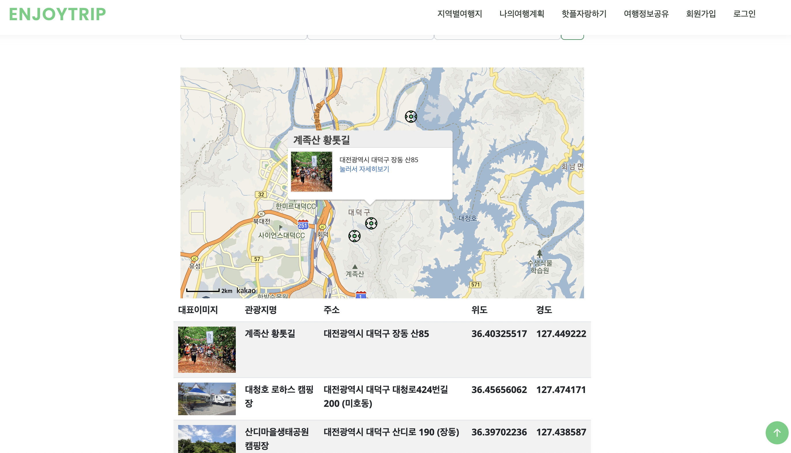
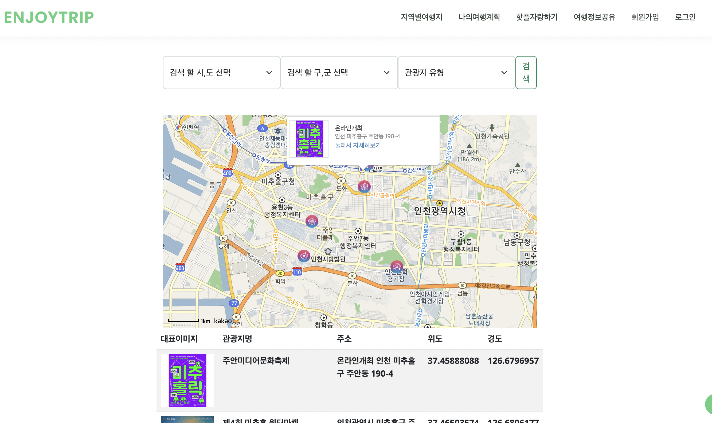
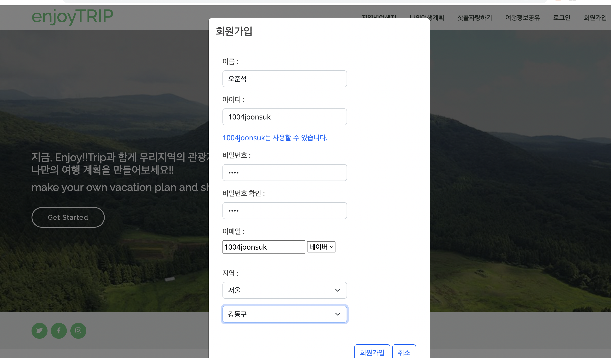
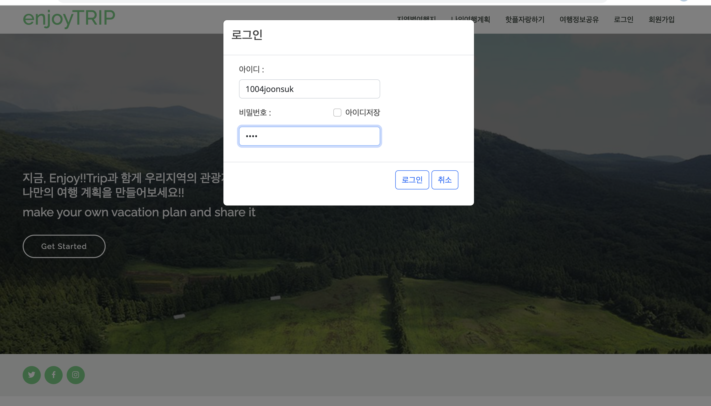
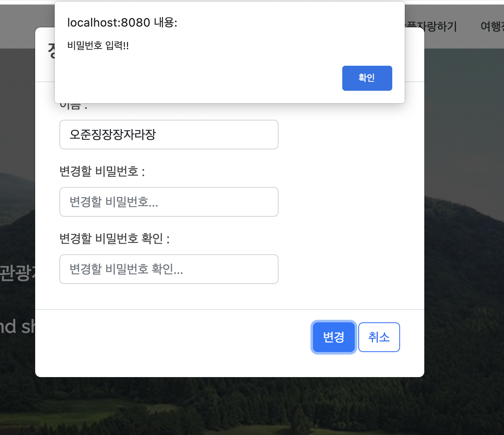
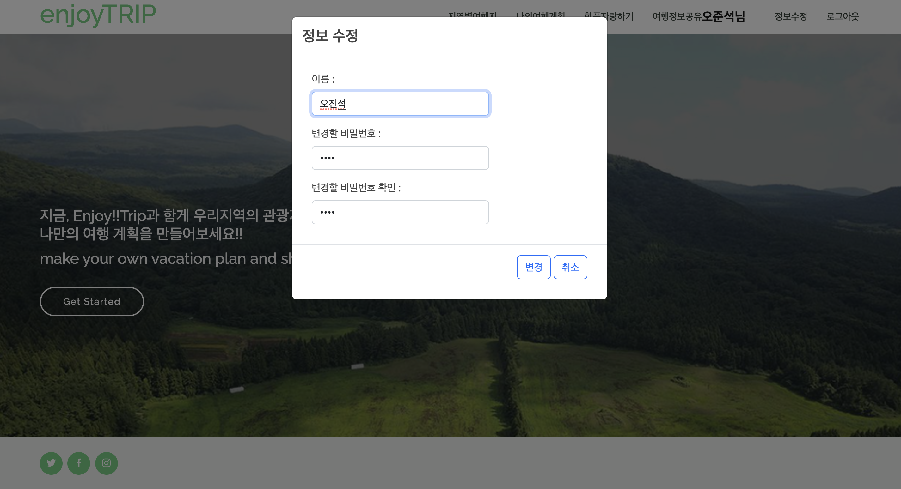

# EnjoyTrip_서울_17_김민석_이효식

---
## DB ERD

### members
| Attribute  | Explain               | Constraints |
|------------|-----------------------|-------------|
| user_id    | 유저 고유 식별자             | PK          |
| user_name  | 유저 이름                 |             |
| user_pwd   | 유저 암호화된 비밀번호          |             |
| user_email | 유저 이메일                |             |
| user_sido  | 유저 시/도 거주지            |             |
| user_sigun | 유저 구/군 거주지            |             |
| salt       | 비밀번호 암호화에 사용되는 랜덤 문자열 |             |

### board
| Attribute     | Explain      | Constraints |
|---------------|--------------|-------------|
| article_no    | 게시글의 고유 식별자  | PK          |
| user_id       | 게시글 작성자의 식별자 | FK          |
| subject       | 게시글 제목       |             |
| content       | 게시글 내용       |             |
| hit           | 게시글 조회수      |             |
| register_time | 게시글 작성 시간    |             |

### followings
| Attribute      | Explain    | Constraints |
|----------------|------------|-------------|
| following_id   | 팔로잉 고유 식별자 | PK          |
| user_id        | 팔로잉 유저 식별자 | FK, UK      |
| follower_id    | 팔로워 유저 식별자 | FK, UK      |
| following_time | 팔로잉 시작 시각  |             |

### replies
| Attribute     | Explain       | Constraints |
|---------------|---------------|-------------|
| reply_id      | 댓글 고유 식별자     | PK          |
| article_no    | 댓글을 단 게시글 식별자 | FK          |
| user_id       | 댓글을 단 유저 식별자  | FK          |
| content       | 내용            |             |
| like          | 좋아요           |             |
| register_time | 댓글 작성 시각      |             |

### hot_places
| Attribute       | Explain         | Constraints |
|-----------------|-----------------|-------------|
| hot_place_id    | 핫플레이스 고유 식별자    | PK          |
| user_id         | 핫플레이스 작성 유저 식별자 |             |
| hot_place_name  | 핫플레이스 이름        |             |
| hot_place_addr  | 핫플레이스 주소        |             |
| hot_place_image | 핫플레이스 이미지       |             |
| latitude        | 핫플레이스 위도        |             |
| longitude       | 핫플레이스 경도        |             |

### plans
| Attribute       | Explain         | Constraints |
|-----------------|-----------------|-------------|
| plan_id         | 여행 계획 고유 식별자    | PK          |
| user_id         | 여행 계획 작성 유저 식별자 | FK          |
| plan_name       | 여행 계획 이름        |             |

### plan_detail
| Attribute  | Explain       | Constraints |
|------------|---------------|-------------|
| plan_order | 여행 계획 내 여행 순서 | PK          |
| plan_id    | 여행 계획 고유 식별자  | FK           |
| content_id | 여행지 고유 식별자     | FK           |
| descript   | 여행 계획 세부 설명   |             |

### attraction
| Attribute       | Explain    | Constraints |
|-----------------|------------|-------------|
| content_id      | 여행지 고유 식별자 | PK          |
| content_type_id | 여행지 타입 식별자 |             |
| title           | 여행지 이름     |             |
| addr            | 여행지 주소     |             |
| image           | 여행지 이미지    |             |
| sido_code       | 여행지 시/도 주소 |             |
| gugun_code      | 여행지 구/군 주소 |             |
| latitude        | 여행지 위도     |             |
| longitude       | 여행지 경도     |             |

---
## 지역별 관광지 조회 페이지

### 관광지 찾기 기능

---

### 레포츠 찾기 기능

---

### 문화시설 찾기 기능

---

### 숙박시설 찾기 기능

---

### 행사/공연/축제 찾기 기능

---

## 회원 정보 페이지

### 회원 가입 기능

---

### 로그인 기능

---

### 정보 수정 기능

---
